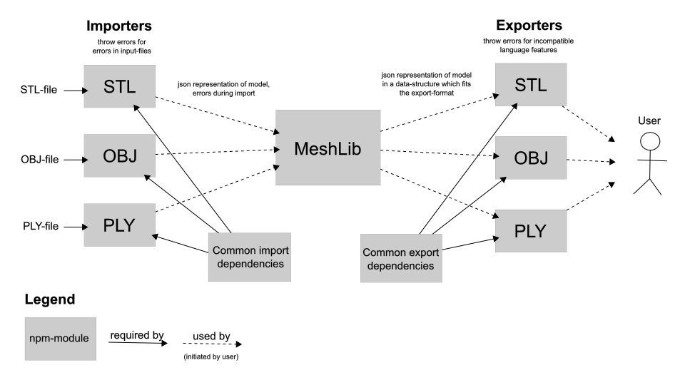

# Meshlib

Meshlib is a javaScript library for importing, handling and exporting various 3D file formats

## Architecture

## Contribution

Please make sure to compile the source files to javascript before commiting
by running following command in the root directory:
`$ ./node_modules/.bin/coffee -co build source`
